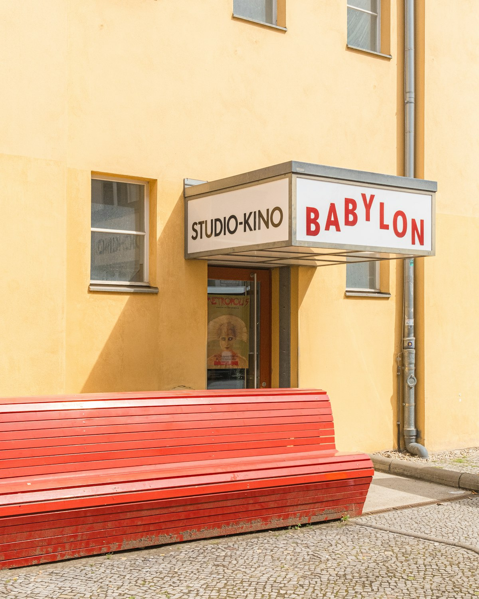
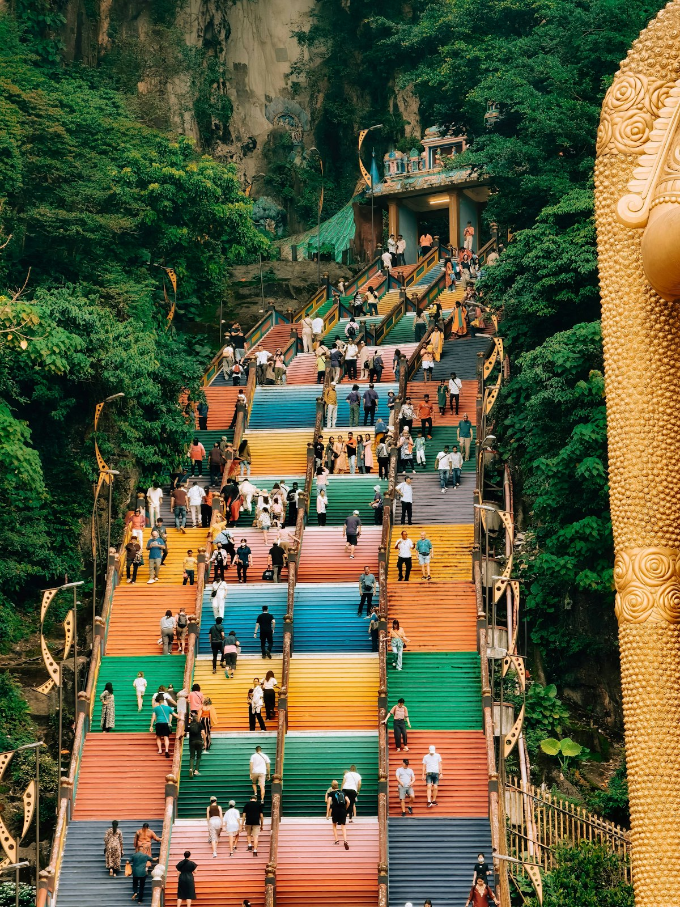
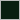
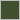
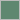
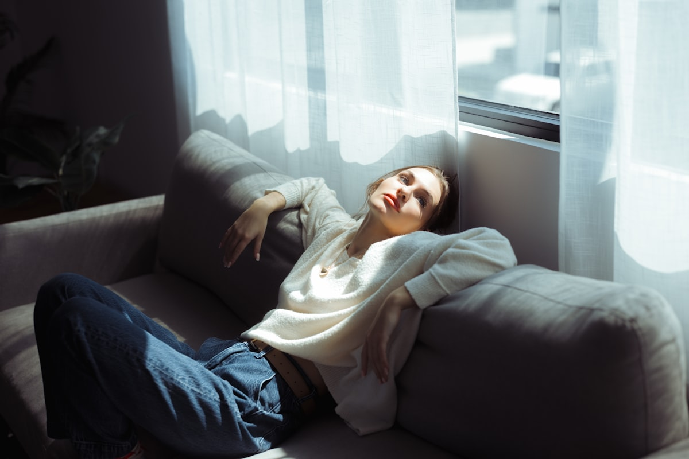
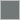

# hue

[](https://github.com/rigter/hue/actions/workflows/ci.yml)

Extract the dominant colors of an image, returned as JSON — with light/dark
info per color so you know what text should sit on top of it.

Zero external dependencies (Go stdlib only). Median-cut quantization picks the
seed colors and a refinement pass settles them onto the image's real clusters.
Seeding is deterministic and ties break on a fixed order, so the same image
always produces the same result — no random initialization anywhere.

## Install

```bash
go get github.com/rigter/hue
```

## Usage

```go
package main

import (
	"fmt"
	"os"

	"github.com/rigter/hue"
)

func main() {
	f, _ := os.Open("example/images/batu-caves-stairs.jpg")
	defer f.Close()

	result, err := hue.Extract(f, hue.Options{
		NumColors:       5,
		IgnoreNearWhite: true, // useful for product photos on white backgrounds
	})
	if err != nil {
		panic(err)
	}

	for _, c := range result.Colors {
		fmt.Printf("%s — %.1f%% — text: %s\n", c.Hex, c.Percentage, c.RecommendedTextColor)
	}
}
```

Or get JSON bytes directly (handy for an HTTP handler):

```go
jsonBytes, err := hue.ExtractJSON(reader, hue.Options{})
```

## Output shape

```json
{
  "colors": [
    {
      "hex": "#dc2828",
      "r": 220,
      "g": 40,
      "b": 40,
      "percentage": 50,
      "luminance": 0.17,
      "isLight": false,
      "recommendedTextColor": "#ffffff"
    }
  ]
}
```

| Field                   | Type    | Meaning                                                                 |
|--------------------------|---------|--------------------------------------------------------------------------|
| `hex`                    | string  | `#rrggbb`                                                                |
| `r`, `g`, `b`            | uint8   | 0–255 components                                                         |
| `percentage`             | float64 | Share of sampled pixels nearest to this color, 0–100                    |
| `luminance`               | float64 | WCAG relative luminance, 0 (black) – 1 (white)                          |
| `isLight`                 | bool    | Display classification: `luminance > 0.5`                                |
| `recommendedTextColor`    | string  | `#000000` or `#ffffff`, whichever has the greater WCAG contrast ratio   |

`colors` is sorted most-to-least dominant.

## Demo

Three sample images live in [`example/images`](./example/images). Each palette
below is the actual output of `go run ./example <image>` with the defaults from
[`example/main.go`](./example/main.go) (`NumColors: 5`, `MaxSampleDim: 100`,
`IgnoreNearWhite: true`). The tables and the color swatches are generated by
[`tools/gendemo`](./tools/gendemo) straight from an extraction run — nothing
below is hand-copied.

<!-- BEGIN GENERATED DEMO -->

### Babylon cinema, Berlin



|   | Hex | RGB | Share | Luminance | Light? | Text on top |
|---|-----|-----|-------|-----------|--------|-------------|
|  | `#f9e0b5` | 249, 224, 181 | 53.65% | 0.77 | yes | `#000000` |
|  | `#e1784b` | 225, 120, 75 | 13.54% | 0.30 | no | `#000000` |
|  | `#d1ab93` | 209, 171, 147 | 12.77% | 0.45 | no | `#000000` |
|  | `#7d361e` | 125, 54, 30 | 11.32% | 0.07 | no | `#ffffff` |
|  | `#957a59` | 149, 122, 89 | 8.72% | 0.21 | no | `#000000` |

### Rainbow stairs, Batu Caves



|   | Hex | RGB | Share | Luminance | Light? | Text on top |
|---|-----|-----|-------|-----------|--------|-------------|
|  | `#0a1f11` | 10, 31, 17 | 35.04% | 0.01 | no | `#ffffff` |
|  | `#3f5030` | 63, 80, 48 | 22.22% | 0.07 | no | `#ffffff` |
|  | `#ce8847` | 206, 136, 71 | 17.53% | 0.31 | no | `#000000` |
|  | `#5e8770` | 94, 135, 112 | 13.07% | 0.21 | no | `#000000` |
|  | `#e6c2a0` | 230, 194, 160 | 12.14% | 0.58 | yes | `#000000` |

### Woman on a sofa



|   | Hex | RGB | Share | Luminance | Light? | Text on top |
|---|-----|-----|-------|-----------|--------|-------------|
|  | `#151215` | 21, 18, 21 | 40.28% | 0.01 | no | `#ffffff` |
|  | `#ddeaeb` | 221, 234, 235 | 21.72% | 0.80 | yes | `#000000` |
|  | `#a3b8ba` | 163, 184, 186 | 13.90% | 0.46 | no | `#000000` |
|  | `#3e393c` | 62, 57, 60 | 12.99% | 0.04 | no | `#ffffff` |
|  | `#717877` | 113, 120, 119 | 11.10% | 0.18 | no | `#000000` |

<!-- END GENERATED DEMO -->

`isLight` is a display classification based on a 0.5 luminance threshold.
`recommendedTextColor` is calculated separately from the WCAG contrast ratio,
so it can recommend black text for a color that is not classified as light.

## Options

| Field              | Default | What it does                                                                 |
|---------------------|---------|--------------------------------------------------------------------------------|
| `NumColors`          | 5       | How many dominant colors to return (may be fewer if the image has less variety) |
| `MaxSampleDim`       | 100     | Caps sampling grid size — keeps cost bounded regardless of source resolution   |
| `IgnoreNearWhite`    | false   | Skips near-white pixels (product photos on white backgrounds)                 |
| `IgnoreNearBlack`    | false   | Skips near-black pixels                                                       |

Fully transparent pixels are ignored. Semi-transparent pixels are composited
over white before extraction, so their colors represent their appearance on a
conventional light background.

## How it works

1. **Sample** the image on a fixed grid (`MaxSampleDim`), so a 4000×3000 photo
   and a 400×300 photo cost about the same to analyze.
2. **Median-cut quantization**: recursively split pixels along their widest
   color-channel range until there are `NumColors` buckets, and average each
   bucket into a candidate color. Median-cut spreads its buckets across the
   color space, which makes it a good way to *choose* candidates.
3. **Refine**: reassign every sampled pixel to its nearest candidate and
   recompute the candidates from what they actually captured, repeating until
   the assignment stops changing. Median-cut alone cannot report dominance —
   it splits each bucket at its median index, so bucket sizes are fixed by the
   shape of the split tree (always 50/25/25 for three colors) no matter what
   the image looks like. On lopsided images a split also lands inside a single
   dominant color, blending unrelated colors into one bucket. Reassignment
   fixes both: `percentage` becomes a real measurement, and the colors land on
   clusters that exist in the image.
4. **Classify** each color's contrast using WCAG relative luminance.

## Development

```bash
go test ./...          # run tests
go vet ./...            # static checks
go run ./example example/images/batu-caves-stairs.jpg
go generate ./...       # regenerate the README demo tables + swatches
```

Run `go generate ./...` after any change to the quantization pipeline, so the
demo section keeps matching what the library actually returns.

## Credits

The demo images in [`example/images`](./example/images) come from
[Unsplash](https://unsplash.com) and are used under the
[Unsplash License](https://unsplash.com/license).

| Image                        | Photographer                                                        | Source                                                                    |
|------------------------------|---------------------------------------------------------------------|---------------------------------------------------------------------------|
| `babylon-cinema-berlin.jpg`  | [Georgi Kalaydzhiev](https://unsplash.com/@jorok)                    | [Unsplash](https://unsplash.com/photos/red-bench-at-babylon-cinema-berlin-pcT8mfj3xAA)  |
| `batu-caves-stairs.jpg`      | [Christian](https://unsplash.com/@axcreativeagency)                  | [Unsplash](https://unsplash.com/photos/rainbow-stairs-at-batu-caves-malaysia-y10y3ZC2_04) |
| `woman-on-sofa.jpg`          | [James Forbes](https://unsplash.com/@vespir)                         | [Unsplash](https://unsplash.com/photos/woman-in-white-sweater-on-sofa-ca9VlaBk9_U)      |

## License

MIT — see [LICENSE](./LICENSE). The demo images are not covered by the MIT
license; see [Credits](#credits).
