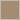
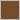
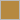
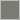

# hue

Extract the dominant colors of an image, returned as JSON — with light/dark
info per color so you know what text should sit on top of it.

Zero external dependencies (Go stdlib only). Deterministic median-cut
quantization, not k-means, so the same image always produces the same result.

## Install

```bash
go get github.com/rigter/hue
```

## Usage

```go
package main

import (
	"fmt"
	"os"

	"github.com/rigter/hue"
)

func main() {
	f, _ := os.Open("example/images/batu-caves-stairs.jpg")
	defer f.Close()

	result, err := hue.Extract(f, hue.Options{
		NumColors:       5,
		IgnoreNearWhite: true, // useful for product photos on white backgrounds
	})
	if err != nil {
		panic(err)
	}

	for _, c := range result.Colors {
		fmt.Printf("%s — %.1f%% — text: %s\n", c.Hex, c.Percentage, c.RecommendedTextColor)
	}
}
```

Or get JSON bytes directly (handy for an HTTP handler):

```go
jsonBytes, err := hue.ExtractJSON(reader, hue.Options{})
```

## Output shape

```json
{
  "colors": [
    {
      "hex": "#dc2828",
      "r": 220,
      "g": 40,
      "b": 40,
      "percentage": 50,
      "luminance": 0.17,
      "isLight": false,
      "recommendedTextColor": "#ffffff"
    }
  ]
}
```

| Field                   | Type    | Meaning                                                                 |
|--------------------------|---------|--------------------------------------------------------------------------|
| `hex`                    | string  | `#rrggbb`                                                                |
| `r`, `g`, `b`            | uint8   | 0–255 components                                                         |
| `percentage`             | float64 | Share of sampled pixels in this color's bucket                          |
| `luminance`               | float64 | WCAG relative luminance, 0 (black) – 1 (white)                          |
| `isLight`                 | bool    | Display classification: `luminance > 0.5`                                |
| `recommendedTextColor`    | string  | `#000000` or `#ffffff`, whichever has the greater WCAG contrast ratio   |

`colors` is sorted most-to-least dominant.

## Demo

Three sample images live in [`example/images`](./example/images). Each palette
below is the actual output of `go run ./example <image>` with the defaults from
[`example/main.go`](./example/main.go) (`NumColors: 5`, `MaxSampleDim: 100`,
`IgnoreNearWhite: true`). The tables and the color swatches are generated by
[`tools/gendemo`](./tools/gendemo) straight from an extraction run — nothing
below is hand-copied.

<!-- BEGIN GENERATED DEMO -->

### Babylon cinema, Berlin


|   | Hex | RGB | Share | Luminance | Light? | Text on top |
|---|-----|-----|-------|-----------|--------|-------------|
|  | `#fae2b5` | 250, 226, 181 | 50.00% | 0.78 | yes | `#000000` |
|  | `#a48d6e` | 164, 141, 110 | 12.50% | 0.28 | no | `#000000` |
|  | `#e27749` | 226, 119, 73 | 12.50% | 0.30 | no | `#000000` |
|  | `#e3b29a` | 227, 178, 154 | 12.50% | 0.51 | yes | `#000000` |
|  | `#7c3b23` | 124, 59, 35 | 12.49% | 0.08 | no | `#ffffff` |

### Rainbow stairs, Batu Caves


|   | Hex | RGB | Share | Luminance | Light? | Text on top |
|---|-----|-----|-------|-----------|--------|-------------|
|  | `#bfa787` | 191, 167, 135 | 25.00% | 0.40 | no | `#000000` |
|  | `#081a0b` | 8, 26, 11 | 25.00% | 0.01 | no | `#ffffff` |
|  | `#1b4a34` | 27, 74, 52 | 25.00% | 0.05 | no | `#ffffff` |
|  | `#724e2c` | 114, 78, 44 | 12.50% | 0.09 | no | `#ffffff` |
|  | `#b68940` | 182, 137, 64 | 12.50% | 0.28 | no | `#000000` |

### Woman on a sofa


|   | Hex | RGB | Share | Luminance | Light? | Text on top |
|---|-----|-----|-------|-----------|--------|-------------|
|  | `#1c191c` | 28, 25, 28 | 49.99% | 0.01 | no | `#ffffff` |
|  | `#d7e6e8` | 215, 230, 232 | 25.01% | 0.77 | yes | `#000000` |
|  | `#98acaf` | 152, 172, 175 | 12.50% | 0.39 | no | `#000000` |
|  | `#7c7b72` | 124, 123, 114 | 6.25% | 0.20 | no | `#000000` |
|  | `#595756` | 89, 87, 86 | 6.24% | 0.10 | no | `#ffffff` |

<!-- END GENERATED DEMO -->

`isLight` is a display classification based on a 0.5 luminance threshold.
`recommendedTextColor` is calculated separately from the WCAG contrast ratio,
so it can recommend black text for a color that is not classified as light.

## Options

| Field              | Default | What it does                                                                 |
|---------------------|---------|--------------------------------------------------------------------------------|
| `NumColors`          | 5       | How many dominant colors to return (may be fewer if the image has less variety) |
| `MaxSampleDim`       | 100     | Caps sampling grid size — keeps cost bounded regardless of source resolution   |
| `IgnoreNearWhite`    | false   | Skips near-white pixels (product photos on white backgrounds)                 |
| `IgnoreNearBlack`    | false   | Skips near-black pixels                                                       |

Fully transparent pixels are ignored. Semi-transparent pixels are composited
over white before extraction, so their colors represent their appearance on a
conventional light background.

## How it works

1. **Sample** the image on a fixed grid (`MaxSampleDim`), so a 4000×3000 photo
   and a 400×300 photo cost about the same to analyze.
2. **Median-cut quantization**: recursively split pixels along their widest
   color-channel range until there are `NumColors` buckets.
3. **Average** each bucket's pixels into one representative color.
4. **Classify** each color's contrast using WCAG relative luminance.

## Development

```bash
go test ./...          # run tests
go vet ./...            # static checks
go run ./example example/images/batu-caves-stairs.jpg
go generate ./...       # regenerate the README demo tables + swatches
```

Run `go generate ./...` after any change to the quantization pipeline, so the
demo section keeps matching what the library actually returns.

## Credits

The demo images in [`example/images`](./example/images) come from
[Unsplash](https://unsplash.com) and are used under the
[Unsplash License](https://unsplash.com/license).

| Image                        | Photographer                                                        | Source                                                                    |
|------------------------------|---------------------------------------------------------------------|---------------------------------------------------------------------------|
| `babylon-cinema-berlin.jpg`  | [Georgi Kalaydzhiev](https://unsplash.com/@jorok)                    | [Unsplash](https://unsplash.com/photos/red-bench-at-babylon-cinema-berlin-pcT8mfj3xAA)  |
| `batu-caves-stairs.jpg`      | [Christian](https://unsplash.com/@axcreativeagency)                  | [Unsplash](https://unsplash.com/photos/rainbow-stairs-at-batu-caves-malaysia-y10y3ZC2_04) |
| `woman-on-sofa.jpg`          | [James Forbes](https://unsplash.com/@vespir)                         | [Unsplash](https://unsplash.com/photos/woman-in-white-sweater-on-sofa-ca9VlaBk9_U)      |

## License

MIT — see [LICENSE](./LICENSE). The demo images are not covered by the MIT
license; see [Credits](#credits).
